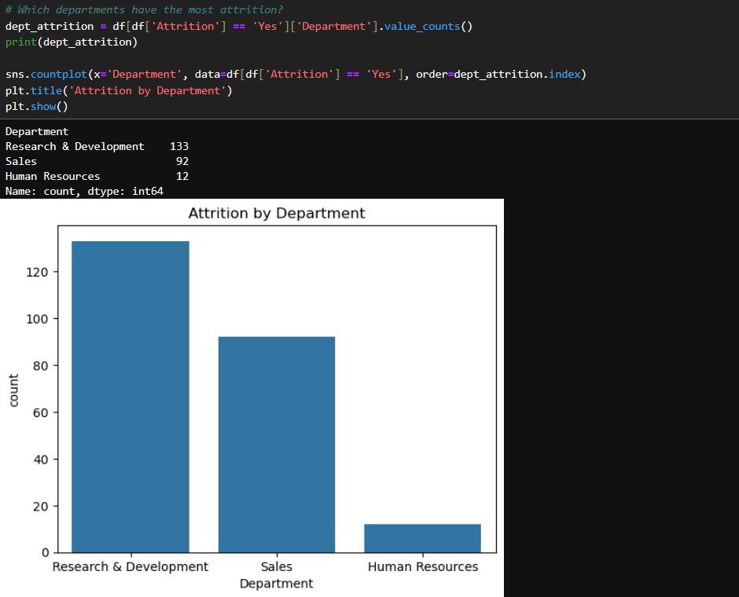
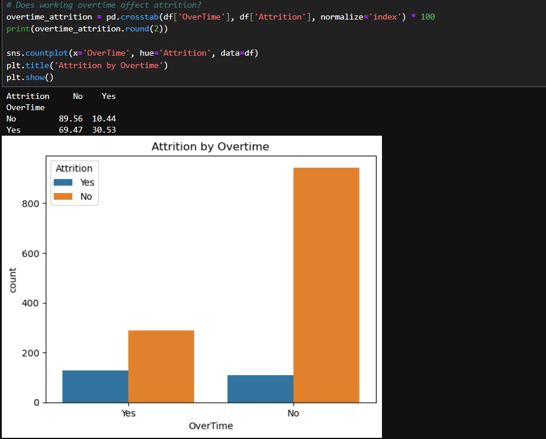
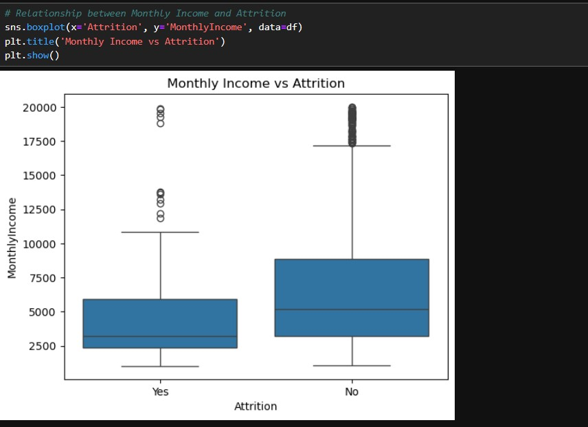

# Employee Attrition Analysis with Python

This project analyzes IBM’s HR dataset to understand the patterns and causes behind employee attrition using Python. It focuses on discovering trends in job satisfaction, overtime, income, department, and gender to support data-driven HR strategies.

## 📊 Dataset

- **Source:** [Kaggle - IBM HR Analytics](https://www.kaggle.com/datasets/pavansubhasht/ibm-hr-analytics-attrition-dataset)
- **File Used:** `WA_Fn-UseC_-HR-Employee-Attrition.csv`

## 🛠️ Tools & Libraries

- Python
- pandas
- matplotlib
- seaborn
- Jupyter Notebook

## ✅ Project Steps

1. Loaded and explored the dataset
2. Checked data types and missing values (clean dataset)
3. Analyzed:
   - Total attrition count
   - Attrition by gender
   - Job satisfaction influence
   - Department-wise attrition
   - Impact of overtime and income on attrition
4. Visualized insights using Seaborn & Matplotlib

## 📌 Key Insights

- Attrition is higher among employees working overtime
- Job satisfaction appears lower for those who left
- Monthly income tends to be lower for employees who left
- Departments like Sales show higher attrition rates

## 💡 Outcome

This project helps HR teams to identify high-risk segments and make better retention strategies based on data.

---

## 🔗 Author

**Ei Chit Chit Po**  
Aspiring Data Analyst | Skilled in Python, SQL, Power BI  
📧 eichitpo2004@gmail.com 
🌐 (https://eichit.github.io/eichit-portfolio/)

